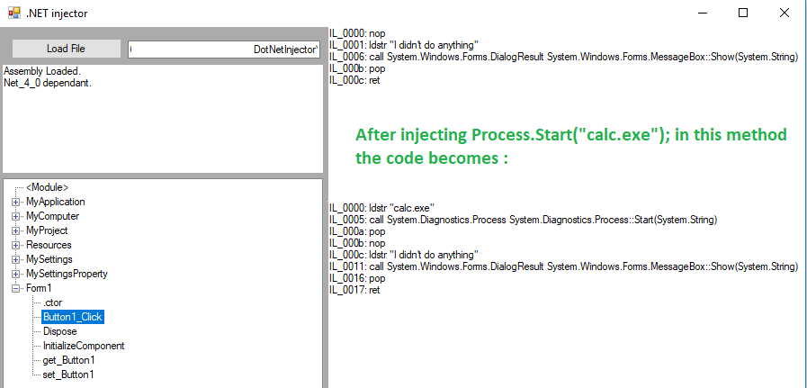

DotNetInjector
==============

Rationale
---------
This program is used to inject code into .NET assemblies, .exe or .dll files.
It uses mono.cecil (https://www.mono-project.com/docs/tools+libraries/libraries/Mono.Cecil/) to inspect and inject IL.

.NET DLLs are a bit harder to hijack than regular DLLs because they do not embed a DLL_MAIN function, hence the need for this program.

Usage
-----
Make sure mono.cecil's DLL is in the path, it's provided in the project.
Launch the application, open a .NET assembly, chose the method in which to inject code then double click on it. Write some code in the popup window, then when ready it's compiled and injected into the assembly.

There's a test binary (VB .net executable) under /test should you need it.

Copyright
---------
This project is a rewrite of und3ath's "und3ath injector" still available at the following URL : https://hostr.co/qFBnh07z2rrm.
It was originally written by und3ath (https://github.com/und3ath/) circa 2012. Thanks mate :)

This version expands its features and has a cleaner codebase.

ToDo
----
Maybe this could be generalized to dynamic injection.
